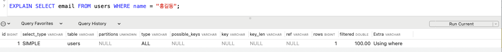
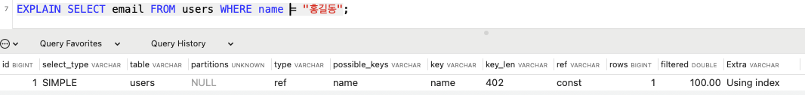

# 인덱스 index

- 테이블의 동작속도(조회)를 높여주는 자료구조 (where 절 등을 통해 활용됨)
- 데이터의 위치를 빠르게 찾아주는 역할
- 인덱스 생성 시에는 DB 크기의 약 10% 정도 되는 추가 공간이 필요함
- insert, update, delete 데이터 변경이 일어나면 paging이 빈번해져 성능이 악화될 수 있음

```sql
select * from users where name = "김해림";
```

> name에 인덱스가 있으면 빠르게 검색이 가능함 <br>
> 인덱스가 없는 경우에는 테이블을 풀 스캔 해야 함 <br>
> -> 풀 스캔하는 경우, 모든 행을 하나씩 읽어보면서 조건을 검사함, 최악의 경우 시간복잡도가 O(n)이고 테이블에 저장된 데이터가 많아질수록 검색 시간도 선형적으로 증가함

> 풀 스캔을 사용하는 경우 <br>
>
> 1. 적용 가능한 인덱스가 없는 경우
> 2. 인덱스 처리 범위가 넓은 경우
> 3. 크기가 작은 테이블에 엑세스하는 경우

## 구현 방식

-> MySQL은 `B-Tree`로 구성되어 있음

### Binary Search Tree 이진탐색 트리

- 자식을 2개 가질 수 있는 노드들로 구성되는 트리 형태의 자료구조
  - 각 노드의 왼쪽 서브 트리에는 자신보다 작은 값 배치
  - 각 노드의 오른쪽 서브 트리에는 자신보다 큰 값 배치

### B-Tree

- 모든 리프 노드가 동일한 레벨에 존재함
- 자식 2개를 갖는 이진트리를 확장하여 N개의 자식을 가질 수 있도록 고안됨
- 기본 데이터베이스 인덱스 구조

### B+Tree

- B-Tree에서 검색 성능을 개선한 자료구조
- InnoDB엔진에서 Index를 관리할 때 B+Tree를 사용함
- B-Tree보다 검색 연산이 빠르고 범위 검색에 유용함
- 범위 검색 : B+Tree는 리프 노드 간에 연결성이 추가된 자료구조이므로 하나의 A 또는 B 중 선형 검색을 통해 위치를 알게되면 리프 노드 간의 연결성을 통해서 나머지 값을 탐색할 수 있음

## 종류

### Clustered Index 클러스터링 인덱스

- 데이터베이스 테이블의 데이터는 클러스터링 인덱스를 기준으로 자동 정렬됨
- 테이블당 1개만 생성할 수 있으며 중복된 값을 가질 수 없음
- **PK로 클러스터링 인덱스가 생성됨**

### Non-Clustered Index = Secondary Index 논클러스터링 인덱스

- 보조 인덱스
- 유니크로 설정된 컬럼에 자동으로 생성됨
- 레코드의 원본은 정렬되지 않으며 인덱스 페이지만 정렬됨
- 한 테이블에 여러 개의 보조 인덱스를 생성할 수 있음
- 인덱스를 통해 데이터 주소를 찾아 원본 테이블에서 데이터를 다시 조회함

### Covering Index 커버링 인덱스

- 쿼리에서 필요한 모든 컬럼이 인덱스에 포함되어 있어서 테이블에 접근하지 않고도 쿼리를 처리할 수 있는 인덱스

### ex)

```sql
CREATE TABLE users (
    id INT PRIMARY KEY AUTO_INCREMENT,
    name VARCHAR(100) NOT NULL,
    email VARCHAR(255) NOT NULL UNIQUE
);
```

- 예제에서 클러스터링 인덱스는 id, 논클러스터링 인덱스는 email

```sql
SELECT email FROM users WHERE name = "홍길동";
```

- (커버링 인덱스) email과 name이 쿼리에 모두 사용됨 -> 테이블 접근 없이 인덱스 만으로 처리하고 싶다면 name, email로 인덱스를 생성해야 함
  - 인덱스를 설정하지 않은 경우 실행계획
    
  - 인덱스를 설정한 경우 실행계획
    

## 복합 인덱스를 설정하는 경우

- 복합 인덱스 : 여러 개의 컬럼을 함께 사용하여 인덱스를 생성
