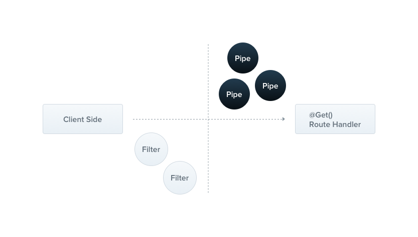

# NestJS

- NodeJs 서버 애플리케이션을 구축하기 위한 프레임워크
- Express기반으로 만들어짐
- 아래 3가지 요소를 포함
  - OOP: 객체 지향 프로그래밍
  - FP: Functional 프로그래밍
  - FRP: Functional React 프로그래밍
- 외부 모듈을 자유롭게 이용할 수 있음
- Unit 테스트와 e2e 테스트를 할 수 있는 툴을 제공
  -> 개발자와 팀이 테스트하기 쉽고 확장 가능하고 느슨하게 결합되고 유지 관리할 수 있는 애플리케이션을 만들 수 있는 즉시 사용 가능한 애플리케이션 아키텍처를 제공

## NestJs 프로젝트 구조

- dist : typescript 코드를 컴파일해서 빌드한 .js 파일이 저장되는 폴더
- node_moduels : package.json에 정의된 패키지 모듈이 설치되는 폴더
- src : typescript 코드가 저장되는 사용자 소스 폴더
- test : test 소스가 저장되는 폴더
- main.ts
  - 애플리케이션 Entry Point 시작 소스
  - 서버를 스타트하고 포트 설정, CORS 등을 정의함
- package.json
  - 프로젝트 설정 파일
  - 사용하는 모듈, 서버 실행 및 빌드 등의 스크립트를 정의함

## Module

- Nest가 애플리케이션 구조를 효율적으로 구성하고 관리하는데 사용하는 메터데이터를 제공
- `AppModule` main.ts에서 지정한 root module
- `@Module` 데코레이터를 사용하여 선언함
- 기본적으로 제공자를 **캡슐화**하므로 현재 모듈의 일부이거나 다른 가져온 모듈에서 명시적으로 내보낸 제공자만 주입할 수 있음


| 항목        | 설명                                                                                                                     |
| ----------- | ------------------------------------------------------------------------------------------------------------------------ |
| providers   | Nest 인젝터에 의해 인스턴스화되고 최소한 이 모듈 전체에서 공유될 수 있는 provider<br>※ Resolver의 경우, providers에 정의 |
| controllers | 해당 모듈에 정의해야 하며, 인스턴스화 되어야 하는 controller                                                             |
| imports     | 해당 모듈에서 사용하는 provider를 가지고 있는 모듈 정의                                                                  |
| exports     | 해당 모듈에서 제공하는 provider를 다른 모듈에서 사용할 수 있게 함                                                        |

### Shared Module (공유 모듈)

- Nest는 싱글톤이기 여러 모듈 간에 쉽게 providers의 동일한 인스턴스를 공유할 수 있음
- 모든 모듈은 자동으로 공유 모듈이 됨

### Global Module (글로벌 모듈)

- Nest는 모듈 범위 내에서 공급자를 캡슐화함
- 어디서나 즉시 사용할 수 있는 공급자 집합을 제공하려는 경우 데코레이터를 사용하여 모듈을 전역으로 `@Global`로 만듦

### Dynamic Module (동적 모듈)

- 하나의 모듈을 다른 모듈로 가져오고, 가져올 때 해당 모듈의 속성과 동작을 사용자 정의할 수 있는 API를 제공

## Controller

- 들어오는 요청을 처리하고 클라이언트에게 응답을 다시 보내는 역할을 담당

### 라우팅

- `@Controller` 데코레이터를 사용하여 경로 지정
- 각 컨트롤러에서 어떤 요청을 수신할지를 정해야 함
- todos인자를 전달하면 `@Controller(’todos’)` Entry Point를 저장함

## Provider

- 서비스, 레포지토리, 팩토리, 헬퍼와 같은 많은 기본 Nest 클래스는 제공자로 취급될 수 있음
- 제공자의 핵심 아이디어는 종속성으로 주입될 수 있어 객체가 서로 다양한 관계를 형성할 수 있으며 객체를 연결하는 책임은 주로 Nest 런타임 시스템에서 처리

### Service

```tsx
@Injectable()
export class TestService {
  private readonly tests: Test[] = [];

  create(test: Test) {
    this.tests.push(test);
  }

  findAll(): Test[] {
    return this.tests;
  }
}
```

- 하나의 속성과 두 개의 메서드가 있는 기본 클래서
- `@Injectable` 데코레이터 : 클래스에 메타데이터를 첨부하여 Nest IoC 컨테이너에서 관리할 수 있는 클래스임을 알림

### Dependency Injection (종속성 주입 : DI)

- 의존성 주입 : 개발자가 필요한 외부 자원 (클래스, 함수 등)을 제공받을 수 있도록 하는 것
- 종속 관계에 있는 Class들이 직접 종속성을 생성하는 것이 아닌 외부(NestJs)서 주입받는 것

### IoC (Inversion of Control) 제어의 역전

- 일반적으로 instance를 생성 또는 삭제는 프로그래머가 관리하는 영역이지만 이를 프레임워크가 관리하도록 제어권이 역전되는 것
  
  

## MiddleWare

- 라우트 핸들러 전에 호출되는 함수
- 요청 및 응답 객체에 엑세스할 수 있으며 next() 애플리케이션 요청-응답 주기에 있는 미들웨어 함수
  

```tsx
import { Injectable, NestMiddleware } from "@nestjs/common";
import { Request, Response, NextFunction } from "express";

@Injectable() // 종속성 주입
export class LoggerMiddleware implements NestMiddleware {
  use(req: Request, res: Response, next: NextFunction) {
    console.log("Request...");
    next();
  }
}
```

## Exception Filter 예외 필터

- 예외 처리 : 예기치 못한 예외의 발생에 미리 대처하는 코드를 작성하는 것
- 예외 필터 : NestJs에서 제공해주는 예외 처리 방식을 그대로 사용해도 되지만 커스터마이징을 하고 싶은 경우 사용

## Pipe 파이프

- 변환 : Client에게 입력받은 데이터 형식을 원하는 형식으로 변환
- 검증 : Client에게 입력받은 데이터의 유효성을 체크하고 데이터가 올바르지 않으면 예외를 던짐
  

## Guard 가드

- NestJS 애플리케이션의 최전선에서 애플리케이션을 보호하는 역할
- NestJS로 들어오는 요청이 컨트롤러에 도달하기 전에 반드시 가드를 거쳐가야 함
- 런타임에 존재하는 특정 조건(ex. 권한, 역할 등)에 따라 주어진 요청이 핸들러에 의해 처리될지 여부를 판단함
- 가드는 모든 미들웨어가 실행된 후에 실행되지만 인터셉터나 파이프가 실행되기 전에 실행됨
  

## interceptor 인터셉터

- AOP 기술에서 영감을 받음
- 메서드 실행 전/후에 추가 로직을 바인딩
- 함수에서 반환한 결과를 변환
- 함수에서 발생한 예외를 변환
- 기본 기능 동작을 확장
- 특정 조건에 따라 함수를 완전히 재정의함
  

**Interceptor와 Middleware의 가장 큰 차이**
Middleware는 파라미터로 request, response, next 세가지를 받음 <br>
-> NestJS에서 request와 response가 HTTP 위에서 동작하게 설계되어 있기 때문에 HTTP 통신이 아니면 사용이 불가 <br>
Interceptor는 파라미터로 execution context라는 helper class를 받아 처리 <br>
-> HTTP 이외에도 WebSocket, GraphQL, RPC(Remote procedure call) 위에서도 동작 가능
