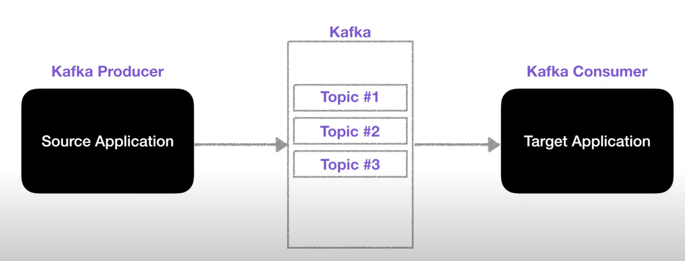
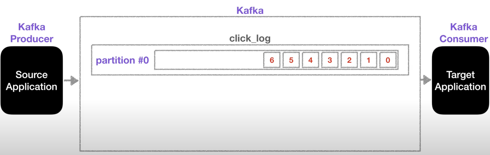
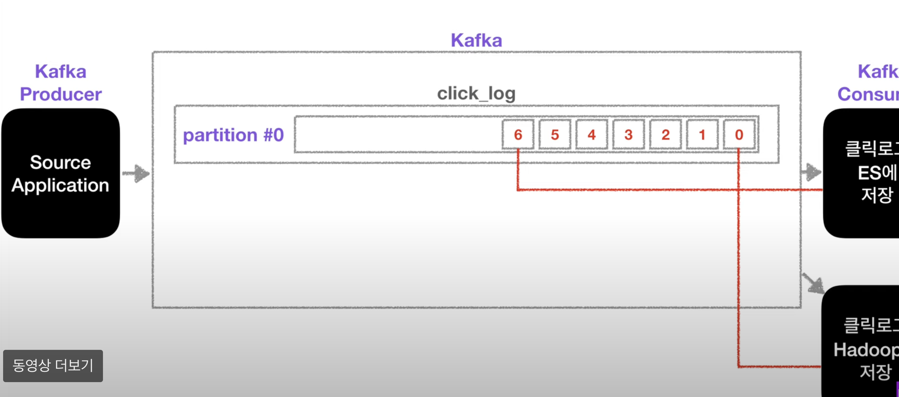
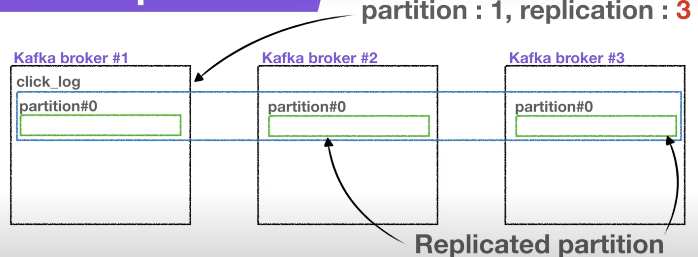
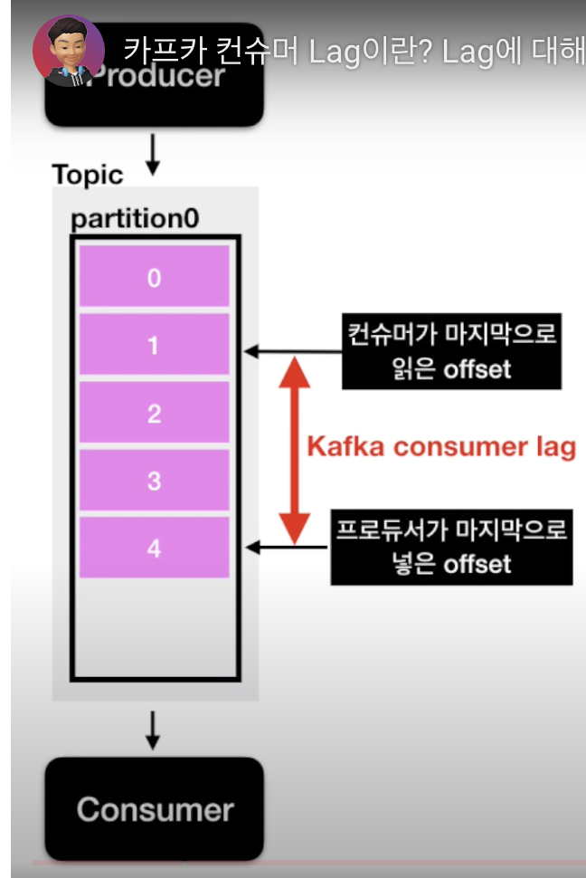

# Kafka

출처. https://www.inflearn.com/course/%EC%95%84%ED%8C%8C%EC%B9%98-%EC%B9%B4%ED%94%84%EC%B9%B4-%EC%9E%85%EB%AC%B8

- 분산 스트리밍 플랫폼, 대량의 데이터를 처리하고 실시간으로 전송하는데 사용
- 모든 데이터는 로그 형식으로 파일 시스템에 기록됨

## 용어정리

- Topic 토픽 : 데이터가 들어가는 공간 / 데이터의 주제를 나타내며 이름으로 분리된 로그, 메시지를 보낼 때 특정 토픽을 지정함
- Partition 파티션 : 각 파티션은 순서가 있는 연속된 메시지의 로그, 병렬 처리를 지원하고 데이터의 분산 및 복제를 관리함
- Record 레코드 : 데이터의 기본 단위로 키와 값 (key-value pair) 구성
- offset 오프셋 : 특정 파티션 내의 레코드 위치를 식별하는 값
- Producer 프로듀서 : 데이터를 토픽에 보내는 역할, 메시지를 생성하고 특정 토픽으로 보냄
- Consumer 컨슈머 : 토픽에서 데이터를 읽는 역할. 특정 토픽의 메시지를 가져와서 (poll) 처리. 컨슈머 그룹은 여러 개의 컨슈머 인스턴스를 그룹화하여 특정 토픽의 파티션을 공유하도록 구성함
- Connector 카프카 커넥터 : 카프카와 외부 시스템을 연동 시 쉽게 연동 가능하도록 하는 프레임 워크

## Topic 토픽

- 메시지를 전송하거나 소비할 때는 Topic을 반드시 입력해야 함
- 하나의 토픽은 한 개 이상의 파티션으로 구성

## Partition 파티션

- Topic 생성 시에 partition 개수를 지정할 수 있음 (추가만 가능하고 삭제는 불가)
- 파티션이 1개라면 처리 순서가 보장됨, 오래된 데이터 먼저 처리
- 컨슈머가 record들을 가져가도 데이터는 삭제되지 않음
  - 컨슈머 그룹이 다른 새로운 컨슈머가 붙었을 때 다시 데이터를 가져갈 수 있음
    
- 파티션이 2개 이상인 경우
  - 키가 null이고 기본 파티셔너를 사용할 경우 → 라운드 로빈으로 할당
  - 키가 있고, 기본 파티셔너 사용할 경우 → 키의 해시(hash) 값을 구하고 특정 파티션에 할당
- 파티션을 늘리는 이유
  - 컨슈머를 늘려서 데이터 처리를 분산할 수 있음
  - 파티션이 여러 개인 경우에는 순서 보장이 되지 않음
- Offset : 컨슈머에서 데이터를 어디까지 읽었는지 저장하는 값, 컨슈머 그룹의 컨슈머들은 각각의 파티션에 자신이 가져간 메시지의 위치 정보를 기록

## Broker 브로커

- 카프카가 설치되어 있는 서버 단위

## Replication 복제

- 파티션의 복제
  - 파티션 1, 레플리케이션 3 → 원본 한 개와 복제본 2개로 구성됨
    
  - 브로커 개수가 3이면 서버가 총 3개이기 때문에 레플리케이션은 4가 될 수 없음
  - 원본 파티션 = Leader partition 리더 파티션
    - 프로듀서가 토픽의 파티션에 데이터를 전달할 때 전달받는 주체
  - 2개의 복제 파티션 = Follower partition 팔로워 파티션
- Leader partition + Follower Partition = ISR (In Sync Replica)

## Producer 프로듀서

- 전송 acks값을 설정하여 효율성을 높힘
  - `ack=0` 매우 빠르게 전송, 리더 파티션에 데이터를 전송하고 응답 값은 받지 않음, 데이터 유실 가능성이 있음
  - `ack=1` 리더 파티션이 데이터를 받았는지 확인, 팔로워 파티션이 복제했는지 알 수 없음, 데이터 유실 가능성이 있음
  - `ack=all` 리더 파티션과 팔로워 파티션이 데이터를 받았는지 확인, 데이터 유실이 없음

## Partitioner 파티셔너

- 데이터를 토픽에 어떤 파티션에 넣을지 결정하는 역할
- 메시지 키가 있는 경우
  - 동일한 메시지 키를 가진 레코드들은 동일한 파티션에 들어가기 때문에 순서를 따라서 처리된다는 장점이 있음
- 메시지 키가 없는 경우
  - 라운드로빈으로 파티션으로 들어감

## Consumer Lag 컨슈머 랙

- 컨슈머의 상태를 볼 때 사용
- 토픽에 파티션이 여러개라면 랙도 여러개가 될 수 있음
