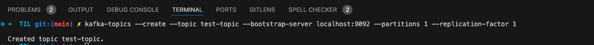
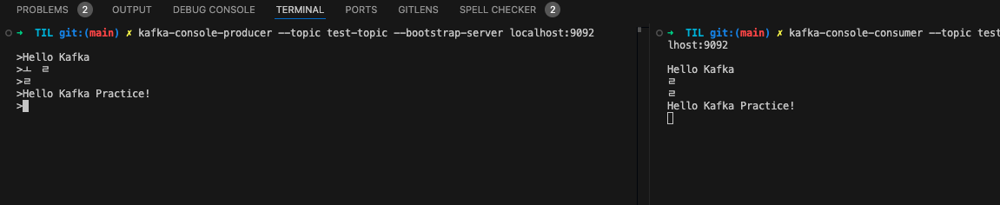
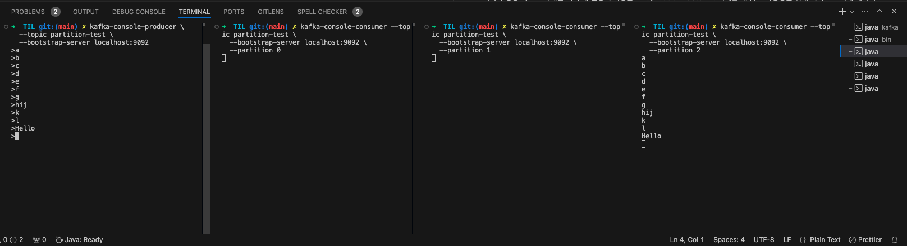

# kafka practice 카프카 실습

## homebrew를 통해 최신 kafka 설치

`brew install kafka`

> 토픽 리스트 확인하기  
> kafka-topics --list --bootstrap-server localhost:9092

## 주키퍼와 카프카 실행하기

### 터미널 1: ZooKeeper 실행

`zookeeper-server-start /opt/homebrew/etc/zookeeper/zoo.cfg`

### 터미널 2: Kafka 실행 (ZooKeeper가 완전히 실행된 후에)

`kafka-server-start /opt/homebrew/etc/kafka/server.properties`

### 새로운 터미널에서 카프카 토픽 생성 명령 실행

`kafka-topics --create --topic test-topic --bootstrap-server localhost:9092 --partitions 1 --replication-factor 1`

| 명령어                            | 설명                                                                                                                   |
| --------------------------------- | ---------------------------------------------------------------------------------------------------------------------- |
| --create                          | 새로운 토픽을 생성                                                                                                     |
| --topic test-topic                | 토픽 이름을 `test-topic`으로 지정, 이 이름으로 메시지를 주고 받음                                                      |
| --bootstrap-server localhost:9092 | kafka의 브로커 주소, localhost:9092는 내 컴퓨터에서 실행 중인 Kafka 브로커를 의미, Kafka와 통신할 때 필수로 지정       |
| --partitions 1                    | 토픽을 구성할 파티션 수, 1이면 메시지가 하나의 파티션에만 저장됨, 병렬 처리나 성능 테스트 시에는 여러 개 설정이 가능함 |
| --replication-factor 1            | 복제본 개수, 고가용성을 위해 여러 브로커에 메시지를 복제할 수 있음 (복제하지 않는 옵션으로 설정)                       |

## 파티션이 한 개인 경우

### 프로듀서 실행 (메시지 보내기)

`kafka-console-producer --topic test-topic --bootstrap-server localhost:9092`
`

### 컨슈머 실행 (메시지 받기)

`kafka-console-consumer --topic test-topic --from-beginning --bootstrap-server localhost:9092`

## 파티션이 여러 개인 경우

파티션이 여러 개인 토픽 만들기

`kafka-topics --create --topic partition-test --bootstrap-server localhost:9092 **--partitions 3** --replication-factor 1`

### key설정없이 프로듀서에서 메시지 발행시 라운드로빈으로 메시지가 할당됨

### TODO 
- key 지정해서 컨슈머에 할당 테스트
